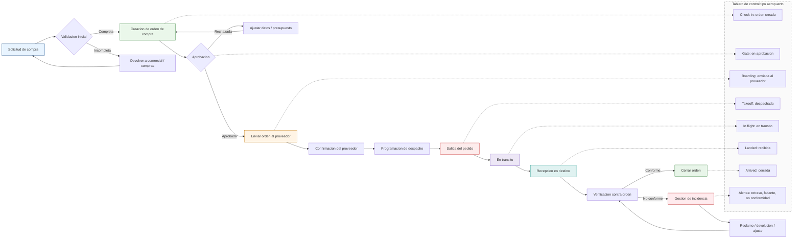

# Diagrama de flujo: Ordenes de compra, tracking y tablero tipo aeropuerto

## Lectura rapida

- `Solicitud de compra`: entra la necesidad.
- `Validacion inicial`: se revisa si la informacion esta completa.
- `Orden de compra`: se crea y se manda a aprobar.
- `Proveedor`: recibe, confirma y programa despacho.
- `Tracking`: la orden pasa por estados operativos hasta recepcion.
- `Cierre`: si todo coincide, se cierra; si no, se abre incidencia.

## Estados del tablero tipo aeropuerto

- `Check-in`: orden creada.
- `Gate`: en aprobacion.
- `Boarding`: enviada al proveedor.
- `Takeoff`: despachada.
- `In flight`: en transito.
- `Landed`: recibida.
- `Arrived`: cerrada.
- `Alertas`: retrasos, faltantes, devoluciones o no conformidades.

## Siguiente paso sugerido

Si quieres, puedo convertir esto en una version mas ejecutiva para gerencia, o en una version operativa con responsables por area: Compras, Comercial, Bodega, Logistica, Calidad y Finanzas.
