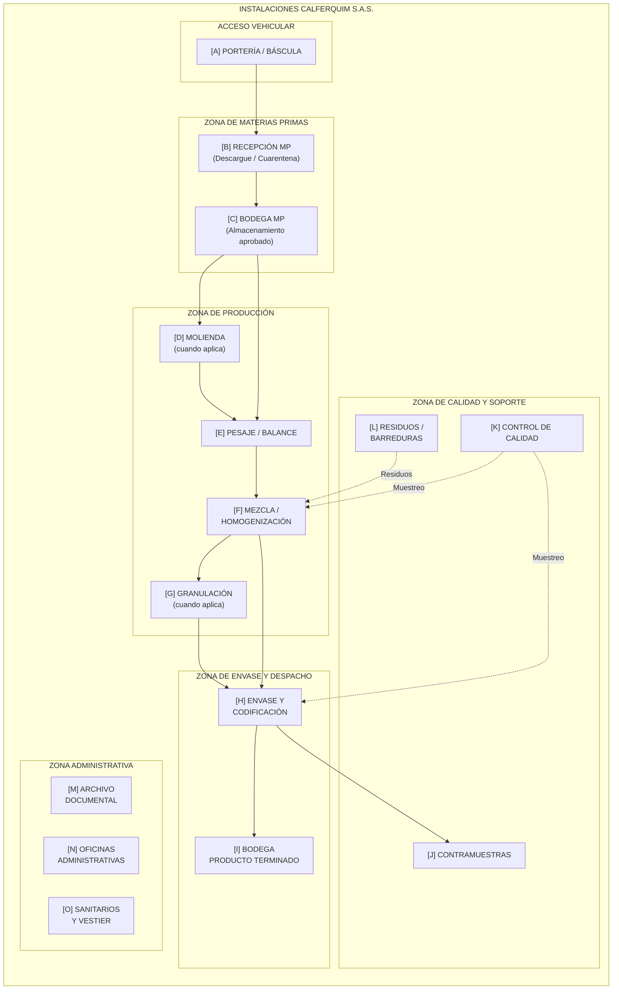

# CROQUIS DE INSTALACIONES — CALFERQUIM S.A.S.

| CÓDIGO | VERSIÓN | VIGENCIA | PRÓXIMA REVISIÓN |
|---|---|---|---|
| **CGC-CRQ-1.1** | **01** | **2026-03-05** | **12 meses o ante cambio de instalaciones** |

---

## 1. OBJETIVO

Describir gráficamente la distribución de áreas, equipos y flujos de materiales dentro de las instalaciones de **CALFERQUIM S.A.S.**, como soporte al numeral 1.1 del Acta de Visita de Verificación de Requisitos ICA (Anexo I-B).

## 2. ALCANCE

Aplica a las instalaciones físicas donde CALFERQUIM S.A.S. realiza las actividades de recepción, producción, control de calidad, envase, almacenamiento y despacho de fertilizantes.

## 3. DESCRIPCIÓN DE ÁREAS

| N° | Área | Descripción | POE / Referencia |
|:---|:---|:---|:---|
| A | Portería / Báscula de pesaje | Acceso vehicular. Báscula para pesaje de MP entrante y PT saliente. | POE-3.01 |
| B | Área de Recepción de MP | Zona de descargue de vehículos proveedores. Inspección visual y toma de muestra inicial. Área de cuarentena para MP pendiente de aprobación. | POE-3.01 |
| C | Bodega de Materias Primas | Almacenamiento de MP aprobadas, clasificadas y etiquetadas por lote. Incluye zona de estibas, señalización de productos, y separación por tipo de material (sólidos granulares, polvos, micronutrientes). | POE-3.01 |
| D | Área de Molienda | Equipo(s) de molienda para reducción de tamaño de partícula de MP cuando se requiere. | POE-3.03 |
| E | Área de Pesaje / Balance | Balanzas de precisión para dosificación de ingredientes según fórmulas. Zona de preparación de lotes con registro de pesos. | POE-3.05 |
| F | Área de Mezcla / Homogenización | Mezcladores / blenders de volteo o de paletas. Zona de carga y descarga de mezcla. Equipo de homogenización. | POE-3.06 |
| G | Área de Granulación | Equipos de granulación (compactadoras, discos o tambores) y tamizado para clasificación granulométrica. Aplica según producto. | POE-3.08 |
| H | Área de Envase y Codificación | Llenadoras de sacos (25, 40 o 50 kg). Cosedoras / selladoras. Equipo de impresión / estampado de código de lote y fecha. | POE-3.10 / POE-3.11 |
| I | Bodega de Producto Terminado | Almacenamiento de PT liberado, organizado por lote y producto. Separado físicamente de bodega de MP. Ventilado y techado. | POE-3.17 |
| J | Área de Contramuestras | Espacio destinado al almacenamiento de contramuestras de cada lote producido, bajo llave, con registro de inventario. | POE-3.14 |
| K | Laboratorio / Área de Control de Calidad | Equipos básicos de muestreo, balanzas de precisión, instrumental de medición. Punto de recepción de muestras para envío a laboratorio externo acreditado. | POE-3.13 |
| L | Área de Residuos / Barreduras | Zona delimitada y señalizada para almacenamiento temporal de residuos de producción, barreduras y producto no conforme, previo a gestión por empresa autorizada. | POE-3.18 |
| M | Área de Archivo Documental | Espacio físico donde reposan: POEs, registros de producción, certificados de análisis, hojas de seguridad, reportes de laboratorio y demás documentos del SGC. | CGC-ACTA-4.12 |
| N | Oficinas Administrativas | Dirección general, coordinación técnica, gestión de calidad y atención al cliente. | POE-3.16 |
| O | Servicios Sanitarios y Vestier | Baños y área de cambio de ropa de trabajo, con dotación de EPP. | POE-3.15 |

## 4. DIAGRAMA DE DISTRIBUCIÓN DE PLANTA (CROQUIS)

> **Nota:** El diagrama representa la distribución lógica de flujo. El croquis físico con medidas y escala exacta se encuentra disponible en formato impreso con firma del Representante Legal y el Asesor Técnico en el Área de Archivo Documental (Área M).

## 5. FLUJO DE MATERIALES

| Flujo | Origen → Destino | Descripción |
|:---|:---|:---|
| Flujo MP | A → B → C | Ingreso, recepción e inspección de materias primas |
| Flujo productivo | C → E → F → H | Balance, mezcla y envase (proceso base) |
| Flujo con molienda | C → D → E → F → H | Balance con reducción de partícula previa |
| Flujo con granulación | F → G → H | Post-mezcla con granulación |
| Flujo de PT | H → I | Almacenamiento tras liberación |
| Flujo de muestras | F / H → K → Lab. Externo | Control de calidad y liberación |
| Flujo de contramuestras | H → J | Retención de muestra de lote |
| Flujo de residuos | F / H → L → Gestor | Disposición de barreduras y residuos |

## 6. EQUIPOS PRINCIPALES POR ÁREA

| Área | Equipos / Elementos |
|:---|:---|
| A — Báscula | Báscula de piso para camiones |
| B — Recepción | Báscula de piso portátil, herramientas de muestreo (caladores, paletas) |
| C — Bodega MP | Estibas, lonas, señalización de productos |
| D — Molienda | Molino de martillos / mandíbulas (según producto) |
| E — Pesaje | Balanza de plataforma (rango 0–500 kg), balanza de precisión (0–5 kg) |
| F — Mezcla | Mezclador de cinta / paletas / volteo (capacidad según lote) |
| G — Granulación | Compactadora de rodillos / granulador de disco |
| H — Envase | Llenadora de sacos, cosedora, impresora de código |
| I — Bodega PT | Estibas, tarimas, señalización de lotes |
| K — Calidad | Balanza analítica, tamices, equipos de muestreo |

## 7. COHERENCIA CON PROCEDIMIENTOS

Este croquis es consistente con:
- **POE-3.01:** Las áreas B y C corresponden al proceso de recepción y almacenamiento de MP.
- **POE-3.05 y 3.06:** Las áreas E y F corresponden al balance y la mezcla.
- **POE-3.08:** El área G corresponde a la granulación.
- **POE-3.10 / 3.11:** El área H corresponde al envase y codificación.
- **POE-3.12 / 3.13:** El área K y la bodega PT (I) corresponden al muestreo y liberación.
- **POE-3.14:** El área J corresponde al almacenamiento de contramuestras.
- **POE-3.17:** El área I corresponde al almacenamiento de producto terminado.
- **POE-3.18:** El área L corresponde a la disposición de residuos.

## 8. NOTA PARA AUDITORÍA

El **croquis físico oficial con escala**, medidas de áreas (m²), demarcación de pasillos de seguridad, ubicación exacta de extintores, botiquín y salidas de emergencia, se encuentra disponible en versión impresa con firma del Representante Legal en el **Área de Archivo Documental**. Este documento digital sirve como referencia descriptiva del mismo.

## 9. APROBACIÓN

| Cargo | Nombre | Firma | Fecha |
|:---|:---|:---|:---|
| Representante Legal | | ___________________ | 2026-03-05 |
| Director Técnico / Asesor | | ___________________ | 2026-03-05 |

## 10. CONTROL DE CAMBIOS

| Versión | Fecha | Descripción |
|:---|:---|:---|
| 01 | 2026-03-05 | Creación inicial del croquis descriptivo de instalaciones. |
