# DIAGRAMA DE FLUJO DEL PROCESO DE FABRICACIÓN

| CÓDIGO | VERSIÓN | VIGENCIA | PRÓXIMA REVISIÓN |
|---|---|---|---|
| **CGC-DFP-1.4** | **01** | **2026-03-05** | **12 meses o ante cambio de proceso** |

---

## 1. OBJETIVO

Describir gráficamente el flujo completo del proceso de fabricación y formulación de fertilizantes de **CALFERQUIM S.A.S.**, desde la recepción de materias primas hasta el almacenamiento de producto terminado, en coherencia con los POEs documentados y las instalaciones físicas visitadas por el ICA.

## 2. ALCANCE

Aplica a todos los productos fabricados y formulados en planta propia, incluyendo mezclas físicas, granulados, y productos de micronutrientes. Referencia cruzada: POEs 3.01 a 3.17.

## 3. DIAGRAMA DE FLUJO GENERAL DEL PROCESO

```mermaid
flowchart TD
    A([INICIO]) --> B

    subgraph REC ["POE-3.01 | RECEPCIÓN DE MATERIAS PRIMAS"]
        B[Llegada de MP a planta\nVehículo proveedor] --> C{Verificación\ndocumental\nRemisión / CoA / FDS}
        C -->|No conforme| D[Rechazo y devolución\nRegistro de Rechazo]
        C -->|Conforme| E[Pesaje en báscula\nAsignación Lote MP]
        E --> F[Inspección física\nMuestra para CC]
        F --> G{¿Aprobada por\nControl Calidad?}
        G -->|No aprobada| H[Cuarentena / Rechazo\nRegistro F-3.01-02]
        G -->|Aprobada| I[Almacenamiento en bodega MP\nEtiquetado de lote]
    end

    subgraph BAL ["POE-3.05 | BALANCE DE MATERIAS PRIMAS"]
        I --> J[Revisión de fórmula\nOrden de Producción]
        J --> K[Pesaje de ingredientes\nsegún formulación]
        K --> L[Verificación de pesos\nRegistro F-3.05]
    end

    subgraph MOL ["POE-3.03 | MOLIENDA PRIMARIA (cuando aplica)"]
        L --> M{¿Requiere\nmolienda?}
        M -->|Sí| N[Molienda de MP\nhasta granulometría requerida]
        M -->|No| O
        N --> O
    end

    subgraph MZC ["POE-3.06 | MEZCLA / HOMOGENIZACIÓN"]
        O[Carga de ingredientes\nen mezclador] --> P[Mezcla según secuencia\ny tiempo establecido]
        P --> Q[Verificación de\nhomogeneidad visual]
        Q --> R{¿Mezcla\nhomogénea?}
        R -->|No| P
        R -->|Sí| S[Descarga de mezcla\nRegistro F-3.06]
    end

    subgraph GRA ["POE-3.08 | PRESENTACIÓN FÍSICA / GRANULACIÓN (cuando aplica)"]
        S --> T{¿Requiere\ngranulación?}
        T -->|Sí - Granulado| U[Granulación\nTamizado y clasificación]
        T -->|No - Polvo/Granular| V
        U --> V
    end

    subgraph ENV ["POE-3.10 | ENVASE"]
        V[Llenado de sacos\nsegún presentación] --> W[Pesaje de sacos\nControl de peso]
        W --> X[Cierre y sellado]
    end

    subgraph COD ["POE-3.11 | CODIFICACIÓN DE LOTES"]
        X --> Y[Impresión / estampado\nde código de lote]
        Y --> Z[Fecha de fabricación\nFecha de vencimiento]
        Z --> AA[Registro F-3.11]
    end

    subgraph MUE ["POE-3.13 | MUESTREO Y CONTROL DE CALIDAD"]
        AA --> AB[Toma de muestras\ndel lote producido]
        AB --> AC[Envío a laboratorio\nexterno acreditado]
        AC --> AD{¿Resultados\nconformes?}
        AD -->|No conforme| AE[Producto No Conforme\nRetrabajo o disposición]
        AD -->|Conforme| AF
    end

    subgraph LIB ["POE-3.12 | LIBERACIÓN DE LOTES"]
        AF[Revisión de registros\nde producción] --> AG{Aprobación\nDirector Técnico}
        AG -->|Aprobado| AH[Emisión Certificado\nde Liberación F-3.12]
        AG -->|Rechazado| AE
    end

    subgraph ALM ["POE-3.17 | ALMACENAMIENTO PRODUCTO TERMINADO"]
        AH --> AI[Traslado a bodega PT\nUbicación por lote]
        AI --> AJ[Registro en\nKardex PT]
        AJ --> AK[Disponible para\ndistribución y venta]
    end

    AK --> AL([FIN])

    subgraph CTR ["POE-3.14 | CONTRAMUESTRAS (paralelo)"]
        AH --> AM[Separación de\ncontramuestra]
        AM --> AN[Almacenamiento en\nárea de contramuestras]
    end

    style REC fill:#e8f4fd,stroke:#2980b9
    style BAL fill:#e8f9e8,stroke:#27ae60
    style MOL fill:#fef9e7,stroke:#f39c12
    style MZC fill:#e8f4fd,stroke:#2980b9
    style GRA fill:#fef9e7,stroke:#f39c12
    style ENV fill:#e8f4fd,stroke:#2980b9
    style COD fill:#fdf2f8,stroke:#8e44ad
    style MUE fill:#fef9e7,stroke:#f39c12
    style LIB fill:#e8f9e8,stroke:#27ae60
    style ALM fill:#e8f4fd,stroke:#2980b9
    style CTR fill:#fdf2f8,stroke:#8e44ad
```

## 4. DESCRIPCIÓN DE ETAPAS

| N° | Etapa | POE Referencia | Responsable | Registro |
|:---|:---|:---|:---|:---|
| 1 | Recepción y almacenamiento de MP | POE-3.01 | Almacenista / Calidad | F-3.01-01, F-3.01-02 |
| 2 | Molienda primaria (cuando aplica) | POE-3.03 | Operario de Producción | F-3.03 |
| 3 | Balance de materias primas | POE-3.05 | Operario / Dirección Técnica | F-3.05 |
| 4 | Mezcla / Homogenización | POE-3.06 | Operario de Mezcla | F-3.06 |
| 5 | Presentación física / Granulación | POE-3.08 | Operario de Producción | F-3.08 |
| 6 | Envase | POE-3.10 | Operario de Envase | F-3.10 |
| 7 | Codificación de lotes | POE-3.11 | Operario / Calidad | F-3.11 |
| 8 | Muestreo y control de calidad | POE-3.13 | Director Técnico | F-3.13 |
| 9 | Liberación de lotes | POE-3.12 | Director Técnico | F-3.12 |
| 10 | Almacenamiento de contramuestras | POE-3.14 | Calidad | F-3.14 |
| 11 | Almacenamiento producto terminado | POE-3.17 | Almacenista | Kardex PT |

## 5. PROCESOS DECLARADOS NO APLICABLES (N/A)

| Numeral | Proceso | Documento de Soporte |
|:---|:---|:---|
| 3.04 | Tratamiento Térmico (Pirolisis) | ACTA-NA-3.04 |
| 3.07 | Reacciones Químicas o Bioquímicas | ACTA-NA-3.07 |
| 3.09 | Molienda secundaria (en flujo continuo) | POE-3.09 (declaración N/A interna) |

## 6. PROCESOS ADICIONALES (COMPLEMENTARIOS)

| Numeral | Proceso | POE Referencia |
|:---|:---|:---|
| 3.02 | Limpieza y desinfección de equipos | POE-3.02 |
| 3.15 | Higiene y seguridad industrial | POE-3.15 |
| 3.16 | Servicio al cliente y PQR | POE-3.16 |
| 3.18 | Disposición de residuos / barreduras | POE-3.18 |
| 3.19 | Formulaciones a terceros | POE-3.19 |
| 3.20 | Entrega de MP en importación a terceros | POE-3.20 |

## 7. CONTROL DE CAMBIOS

| Versión | Fecha | Descripción |
|:---|:---|:---|
| 01 | 2026-03-05 | Creación inicial del diagrama de flujo de proceso de fabricación. |
