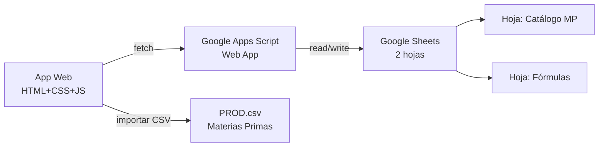

# Formulador de Fertilizantes — FORMULADOR_CFQ

Aplicación web que automatiza el cálculo del grado final de fertilizantes para CALFERQUIM. Las materias primas se importan desde CSV, las fórmulas se arman manualmente, y cada combinación se guarda en **Google Sheets** para poder verificarla, editarla o clonarla.

## Contexto del Dominio

Según [formula.md](file:///home/w182/w421/cfq_sgc/SGC_CALFERQUIM/formula.md), el proceso tiene 5 etapas. Según [tolerancia.md](file:///home/w182/w421/cfq_sgc/SGC_CALFERQUIM/tolerancia.md), las tolerancias se calculan con fórmulas polinómicas/lineales específicas por nutriente.

### Fuentes de Datos

| Archivo | Uso |
|---------|-----|
| [FORMULADOR - PROD.csv](file:///home/w182/w421/cfq_sgc/SGC_CALFERQUIM/FORMULADOR%20-%20PROD.csv) | Catálogo de ~465 materias primas con composición química → se importa al arrancar |
| [tolerancia.md](file:///home/w182/w421/cfq_sgc/SGC_CALFERQUIM/tolerancia.md) | Fórmulas de tolerancia → se codifican directamente en el motor de cálculo |
| Google Sheets | Almacena cada fórmula creada → permite guardar, editar, clonar, re-verificar |

### Fórmulas de Tolerancia (de [tolerancia.md](file:///home/w182/w421/cfq_sgc/SGC_CALFERQUIM/tolerancia.md))

**Grupo 1 — N y P:**
```
Si X = 0      → T = 0
Si X < 0.04   → T = 0.84
Si X > 32     → T = 1.46
Si 0.04 ≤ X ≤ 32 → T = -0.0005×X² + 0.0413×X + 0.6533
```

**Grupo 2 — K:**
```
Si X = 0      → T = 0
Si X < 0.04   → T = 0.69
Si X > 32     → T = 2.14
Si 0.04 ≤ X ≤ 32 → T = -0.0007×X² + 0.0769×X + 0.3941
```

**Grupo 3 — Secundarios y Micronutrientes:**
```
T = min(X/2, 1.5, ecuación_lineal(X))
```
Donde la ecuación lineal varía:
| Nutriente | Ecuación |
|-----------|----------|
| CaO | 0.42 + 0.105×X |
| MgO | 0.5 + 0.125×X |
| S | 0.3 + 0.075×X |
| B | 0.005 + 0.25×X |
| Co, Mo | 0.000125 + 0.375×X |
| Cu, Fe, Mn, Zn, Na | 0.015 + 0.3×X |

---

## Arquitectura



### Google Sheets como Backend

Se usará un **Google Apps Script** desplegado como Web App que expone una API REST para:

| Endpoint | Método | Descripción |
|----------|--------|-------------|
| `/exec?action=getMP` | GET | Leer catálogo de materias primas |
| `/exec?action=saveMP` | POST | Guardar/actualizar catálogo de MP (importación CSV inicial) |
| `/exec?action=getFormulas` | GET | Listar todas las fórmulas guardadas |
| `/exec?action=getFormula&id=X` | GET | Obtener detalle de una fórmula |
| `/exec?action=saveFormula` | POST | Guardar nueva fórmula |
| `/exec?action=updateFormula` | POST | Actualizar fórmula existente |
| `/exec?action=deleteFormula` | POST | Eliminar fórmula |

### Hojas en el Google Sheet

**Hoja 1: `catalogo_mp`**
- Columnas: ID_PROD, COD, PRODUCTO, PROVEEDOR, Cprov, CLASE, TIPO, NOMBRE, C, N, N-NH4, N-NO3, N-org, N-ur, P, K, CaO, MgO, S, B, Co, Cu, Fe, Mn, Mo, SiO2, Zn, Na

**Hoja 2: `formulas`**
- Columnas: ID, FECHA, COD_PROD_DESTINO, NOMBRE_DESTINO, TOTAL_PROD, MP1_COD, MP1_NOMBRE, MP1_CANTIDAD, MP1_LOTES, ...(×11 MPs)..., T_C, T_N, T_N-NH4, T_N-NO3, T_N-org, T_N-ur, T_P, T_K, T_CaO, T_MgO, T_S, T_B, T_Co, T_Cu, T_Fe, T_Mn, T_Mo, T_SiO2, T_Zn, T_Na, ESTADO (borrador/verificada), FECHA_CREACION, FECHA_MODIFICACION

---

## User Review Required

> [!IMPORTANT]
> **Google Sheets**: Necesitaré que cree un Google Sheet vacío y me proporcione el ID (la parte de la URL entre `/d/` y `/edit`). Yo crearé el código del Apps Script que se despliega como Web App.

> [!IMPORTANT]
> **Acceso**: El Apps Script se desplegará como Web App accesible "para cualquiera" (sin autenticación) para simplificar. Si necesita restricción de acceso, puedo añadir un token simple. ¿Es aceptable?

---

## Proposed Changes

La app se creará en `/home/w182/w421/cfq_sgc/SGC_CALFERQUIM/formulador/`.

### Componente 1 — Google Apps Script (Backend)

#### [NEW] [google-apps-script.js](file:///home/w182/w421/cfq_sgc/SGC_CALFERQUIM/formulador/google-apps-script.js)
- Código para copiar y pegar en el editor de Apps Script de Google
- Funciones `doGet()` y `doPost()` que actúan como API REST
- CRUD completo para las hojas `catalogo_mp` y `formulas`
- Manejo de CORS para que la app web pueda comunicarse
- Auto-creación de hojas con headers si no existen
- Función de importación masiva de MP (para el CSV inicial)

---

### Componente 2 — Estructura y Diseño de la App Web

#### [NEW] [index.html](file:///home/w182/w421/cfq_sgc/SGC_CALFERQUIM/formulador/index.html)
- SPA con 3 vistas: **Catálogo MP**, **Formulador**, **Fórmulas Guardadas**
- Navigation bar con tabs y logo CALFERQUIM
- Modal system para detalle de productos y confirmaciones
- Toast notifications para feedback de operaciones
- Loading states para llamadas a Google Sheets
- Fuente Inter (Google Fonts)

#### [NEW] [index.css](file:///home/w182/w421/cfq_sgc/SGC_CALFERQUIM/formulador/index.css)
- Paleta industrial/agrícola:
  - Primary: `#1a472a` (verde oscuro)
  - Secondary: `#2d5a3f` (verde medio)
  - Accent: `#f59e0b` (ámbar)
  - Surface: `#0f1419` (negro azulado)
  - Text: `#e8eaed` (blanco cálido)
- Dark mode por defecto, cards con glassmorphism
- Micro-animaciones: hover en filas de tabla, transiciones de tab, loading spinner
- Grid responsive (desktop-first, adaptable a tablet)
- Estilos para semáforo de tolerancias: verde ✅ / ámbar ⚠️ / rojo ❌

---

### Componente 3 — Módulo de Datos y Comunicación

#### [NEW] [modules/api.js](file:///home/w182/w421/cfq_sgc/SGC_CALFERQUIM/formulador/modules/api.js)
- Cliente HTTP para comunicarse con Google Apps Script
- URL del Web App configurable
- Funciones: `fetchMP()`, `saveMP()`, `fetchFormulas()`, `saveFormula()`, `updateFormula()`, `deleteFormula()`
- Cache local (localStorage) del catálogo de MP para rendimiento
- Manejo de errores y reintentos
- Indicadores de estado de conexión

#### [NEW] [modules/csv-parser.js](file:///home/w182/w421/cfq_sgc/SGC_CALFERQUIM/formulador/modules/csv-parser.js)
- Parser CSV robusto:
  - Maneja separador decimal coma → punto (`"18,00"` → `18.00`)
  - Campos entrecomillados con comas
  - Caracteres especiales (tildes, ñ)
  - Detección automática de delimitador
- Función `parseProduccionCSV(text)` → array de objetos MP
- Validación de estructura del CSV

---

### Componente 4 — Vista de Catálogo de Materias Primas

#### [NEW] [modules/catalogo.js](file:///home/w182/w421/cfq_sgc/SGC_CALFERQUIM/formulador/modules/catalogo.js)
- Tabla interactiva con todas las materias primas importadas
- Columnas: COD, PRODUCTO, PROVEEDOR, TIPO, N, P, K, CaO, MgO, S + "Ver más"
- Búsqueda instantánea (filtrado client-side)
- Filtros dropdown: CLASE (MP/PT), TIPO (G/P/L/C)
- Botón "Importar CSV" → file picker → parser → envío a Google Sheets
- Click en fila → modal con composición completa (todos los nutrientes)
- Barras de color para los nutrientes principales (visualización rápida)

---

### Componente 5 — Motor de Cálculo y Formulador (vista principal)

#### [NEW] [modules/formulador.js](file:///home/w182/w421/cfq_sgc/SGC_CALFERQUIM/formulador/modules/formulador.js)

**La vista central de la app.** Layout en dos columnas:

**Columna izquierda — Configuración de la mezcla:**
- Campo: Producto destino (dropdown buscable del catálogo PT)
- Campo: Total producción (kg)
- Campo: Fecha
- **Bloque de 11 slots de Materia Prima**, cada uno con:
  - Dropdown buscable de MPs (filtra solo CLASE=MP)
  - Input numérico: Cantidad (proporción 0.00–1.00), step 0.01
  - Texto: Lotes (campo libre para anotar lotes)
  - Botón ❌ para vaciar slot
- **Barra de progreso total**: suma de cantidades → muestra cuánto queda para llegar a 1.00
  - Verde si suma ≤ 1.00, rojo si > 1.00
- Botones: **Calcular**, **Guardar**, **Limpiar**

**Columna derecha — Resultados (cálculo en tiempo real):**
- **Tabla de Grado Final**: todos los nutrientes con su valor calculado
- **Tabla de Tolerancias**: para cada nutriente, muestra:
  - Valor calculado (T_X)
  - Valor declarado del PT destino (composición del producto seleccionado)
  - Tolerancia permitida (calculada con fórmulas de [tolerancia.md](file:///home/w182/w421/cfq_sgc/SGC_CALFERQUIM/tolerancia.md))
  - Rango aceptable: `[declarado - tolerancia, declarado + tolerancia]`
  - Semáforo: ✅ C / ⚠️ SUP / ❌ NC
- **Resumen visual**: tarjetas grandes con N-P-K y estado general

#### [NEW] [modules/tolerancias.js](file:///home/w182/w421/cfq_sgc/SGC_CALFERQUIM/formulador/modules/tolerancias.js)
- Implementación exacta de las 3 reglas de [tolerancia.md](file:///home/w182/w421/cfq_sgc/SGC_CALFERQUIM/tolerancia.md)
- `calcTolerancia(nutriente, valorTeorico)` → retorna el margen permitido
- `evaluar(nutriente, valorCalculado, valorDeclarado)` → retorna `"C"`, `"NC"`, o `"SUP"`
- Funciones puras, testeables individualmente

---

### Componente 6 — Vista de Fórmulas Guardadas

#### [NEW] [modules/formulas-guardadas.js](file:///home/w182/w421/cfq_sgc/SGC_CALFERQUIM/formulador/modules/formulas-guardadas.js)
- Lista de todas las fórmulas guardadas en Google Sheets
- Tabla con: ID, Fecha, Producto destino, N-P-K calculado, Estado
- **Acciones por fórmula**:
  - 👁️ **Ver**: abre detalle completo (composición + tolerancias)
  - ✏️ **Editar**: carga la fórmula en el Formulador para modificarla
  - 📋 **Clonar**: crea copia editable en el Formulador
  - 🔄 **Re-verificar**: recalcula tolerancias con datos actuales del catálogo
  - 🗑️ **Eliminar**: con confirmación
- Filtros por fecha, producto, búsqueda libre
- Ordenamiento por columnas

---

### Componente 7 — Controlador Principal

#### [NEW] [app.js](file:///home/w182/w421/cfq_sgc/SGC_CALFERQUIM/formulador/app.js)
- Router SPA con hash navigation (`#catalogo`, `#formulador`, `#formulas`)
- Inicialización: cargar catálogo MP desde Google Sheets (o cache)
- Gestión de estado global
- Configuración de URL del Apps Script Web App

#### [NEW] [modules/utils.js](file:///home/w182/w421/cfq_sgc/SGC_CALFERQUIM/formulador/modules/utils.js)
- Formateo numérico (2 decimales, locale español)
- Generación de ID único (hash hex de 8 caracteres, como en el CSV)
- Formateo de fechas DD/MM/YYYY
- Debounce para búsqueda
- Funciones de validación

---

## Resumen de Archivos

```
formulador/
├── index.html                 # SPA principal
├── index.css                  # Design system completo
├── app.js                     # Router + controlador
├── google-apps-script.js      # ← Copiar a Google Apps Script
└── modules/
    ├── api.js                 # Cliente HTTP → Google Sheets
    ├── csv-parser.js          # Parser de PROD.csv
    ├── catalogo.js            # Vista catálogo de MP
    ├── formulador.js          # Motor de cálculo + UI formulación
    ├── tolerancias.js         # Fórmulas de tolerancia (3 grupos)
    ├── formulas-guardadas.js  # CRUD de fórmulas guardadas
    └── utils.js               # Utilidades compartidas
```

---

## Verification Plan

### Validación de Tolerancias
Verificar con ejemplo de [tolerancia.md](file:///home/w182/w421/cfq_sgc/SGC_CALFERQUIM/tolerancia.md):
- MgO = 4% → min(4/2=2, 1.5, 0.5+0.125×4=1.0) = **1.0%** ✅

### Validación de Cálculo
Tomar orden real del CSV de verificación (ej: producto 141, KIESERITA 0.05 + SULFATO CALCIO 0.75 + SILICATO MAGNESIO 0.05 + CARBONATO CALCIO 0.15):
- Recalcular T_CaO, T_MgO, T_S, T_SiO2 y comparar con valores del CSV

### Validación de Google Sheets
- Crear Sheet de prueba, desplegar Apps Script
- Importar CSV completo, verificar 465 filas en la hoja
- Guardar 3 fórmulas, editar una, clonar otra, eliminar una
- Verificar que re-verificar recalcula correctamente

### Validación de UI
- Abrir app, importar CSV, crear fórmula
- Verificar cálculo en tiempo real al modificar cantidades
- Verificar semáforos de tolerancia
- Probar guardar/editar/clonar flujo completo
