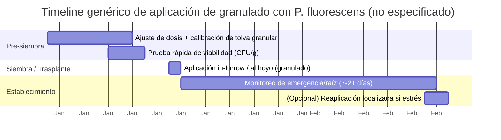

# Uso de *Pseudomonas fluorescens* en fertilizantes granulados: informe analítico y riguroso

## Resumen ejecutivo

*Pseudomonas fluorescens* (en la práctica, un **complejo de especies** y linajes) es una bacteria **Gram‑negativa, estrictamente aerobia, móvil** y muy competente para **colonizar rizosfera** y competir por recursos, rasgos que sustentan su uso como **PGPR** (plant growth‑promoting rhizobacteria) y como agente de **control biológico**. citeturn14view1turn14view2turn29search20 En fertilizantes **granulados**, el reto principal no es su eficacia potencial, sino la **formulación**: al no ser esporulada y ser sensible a **desecación, estrés osmótico y contactos con sales/fertilizantes**, la viabilidad puede caer rápidamente si no se protege con portadores, polímeros, encapsulación o procesos de secado controlados. citeturn16view0turn17view2turn38view0

La evidencia más sólida para “microorganismos en gránulos” proviene de: (i) estudios de **portadores sólidos** (talc vs. turba) que muestran reducciones de varias órdenes de magnitud en CFU/g durante almacenamiento; citeturn17view2 (ii) tecnologías de **gránulos tipo “pesta”** (fermentación → mezclado → extrusión → esferonización → secado en lecho fluidizado) desarrolladas para *P. fluorescens* (p. ej., BRG100) que demuestran que el **control de actividad de agua (a_w)** es crítico (mejor supervivencia alrededor de **a_w≈0.2**); citeturn38view0turn38view1 y (iii) encapsulación en matrices como **alginato** (microesferas secas) que puede mantener funcionalidad biocontroladora tras almacenamiento prolongado, aunque con pérdidas iniciales de viabilidad por el secado. citeturn16view0turn16view3

En cuanto a **dosis**, hay una brecha entre literatura académica y práctica comercial cuando el vehículo es un granulado “fertilizante”. Para orientar decisiones, es recomendable trabajar con tres referencias cuantitativas: (1) estándares de calidad típicos para bioinoculantes sólidos (orden de **10⁷–10⁸ CFU/g** como objetivo de fabricación; en algunas referencias mínimas ~**5×10⁷ CFU/g** para portadores sólidos); citeturn7search16 (2) densidad umbral de colonización/efecto en raíz en algunos modelos de ISR (≈**10⁵ CFU/g de raíz**); citeturn39search7 y (3) tasas reales de aplicación en productos granulares comerciales de inoculación en surco (ejemplo con **Pseudomonas sp. 10⁴ CFU/g** y **1.0–6.2 kg/ha** según espaciamiento; útil como comparación, aunque no es *P. fluorescens* “principal” ni necesariamente fertilizante). citeturn38view2

Regulatoriamente, si se pretende comercializar como **biostimulante microbiano CE** en la UE, el Reglamento (UE) 2019/1009 limita los microorganismos permitidos a **Azotobacter spp., Azospirillum spp., Rhizobium spp. y hongos micorrícicos** (no incluye *Pseudomonas*), lo que obliga a rutas alternativas (p. ej., normativa nacional, o registro como producto fitosanitario/biocida según el caso). citeturn42view0turn42view3 En Colombia, el enfoque práctico pasa por requisitos de **registro de empresas/productos de bioinsumos** ante ICA y el marco técnico‑normativo impulsado por ANLA/ICA/AGROSAVIA, con exigencia probable de dossier de calidad, inocuidad y eficacia según categoría de producto. citeturn6search14turn6search24

**Recomendación práctica central**: si el objetivo real es “fertilizante granulado con *P. fluorescens* viable”, la estrategia más robusta es (a) **separar** el inoculante del núcleo salino del fertilizante (doble gránulo, recubrimiento barrera, microcápsulas), (b) controlar **humedad/a_w** y temperatura durante fabricación y almacenamiento, y (c) exigir especificaciones de **CFU/g al envasado y a caducidad**, además de pruebas de compatibilidad con la química del fertilizante y con microorganismos co‑formulados. citeturn16view0turn38view0turn17view2

---

## Contexto, taxonomía y características microbiológicas

*P. fluorescens* se describe clásicamente como **bacilo Gram‑negativo**, **catalasa+**, **oxidasa+**, **no fermentador** (ataca azúcares por oxidación), **estrictamente aeróbico** y **móvil**. citeturn14view1 La producción del pigmento sideróforo **pyoverdina** (fluorescente bajo UV) es un rasgo frecuente y puede estimularse en agar King’s B. citeturn14view1 Morfológicamente, bases de datos de cepas tipo reportan dimensiones celulares del orden de **1–2 μm de largo** y **0.3–0.6 μm de ancho** (dependiente de condiciones/cepa). citeturn18view0

Un punto crítico para formulación y regulación es que “*P. fluorescens*” funciona como un **complejo de especies** muy diverso: el grupo incluye >50 especies válidamente nombradas y múltiples linajes con rasgos ecológicos y metabólicos distribuidos por filogrupos. citeturn14view2 Esto implica que propiedades clave (antibiosis, fitohormonas, ISR, etc.) son **cepa‑dependientes** y no pueden extrapolarse con seguridad solo por el nombre de especie. citeturn14view2 Además, dentro del complejo existen especies fitopatógenas u oportunistas (p. ej., asociadas a necrosis de médula en tomate o enfermedad en champiñón), lo que refuerza la necesidad de **identificación genómica/MLSA** y cribado de seguridad por cepa. citeturn14view2turn15view0

**Tolerancias ambientales relevantes para granulación**: (i) crecimiento óptimo típico alrededor de **25–30 °C** y capacidad psicrótrofa en algunos contextos (relevante para almacenamiento y ecología); citeturn14view1turn18view0 (ii) evidencias experimentales de crecimiento en caldos a pH **5.5–6.3** en estudios de cinética (aunque no define “rango total” en suelo); citeturn26view0 (iii) tolerancia a salinidad reportada en datos de cepa tipo con crecimiento a **8% NaCl** (y ensayos reportados a 10%, dependiendo del registro), lo cual no garantiza supervivencia en contacto directo con fertilizantes de alta fuerza iónica, pero sugiere margen fisiológico. citeturn19view0

**Implicación para fertilizantes granulados**: su fisiología aerobia y no fermentativa facilita crecimiento industrial en fermentación aireada, pero su supervivencia en un gránulo seco y/o salino exige protección física‑química (matrices, polímeros, humectantes controlados y baja actividad de agua). citeturn16view0turn38view0

---

## Propiedades y funciones agronómicas

La literatura ubica a *P. fluorescens* (y pseudomonas fluorescentes cercanas) como PGPR por cuatro familias de mecanismos: **promoción directa de crecimiento**, **mejoras de nutrición**, **control biológico** e **inducción de resistencia sistémica (ISR)**. citeturn39search1turn14view2turn29search20

En **control biológico**, el cuerpo de evidencia más influyente se apoya en la producción de **metabolitos antimicrobianos** durante colonización de raíz: antibióticos y sideróforos, además de interferencia con factores de patogenicidad e ISR en la planta hospedera. citeturn39search1turn39search13 La biosíntesis y distribución filogenética de metabolitos como **2,4‑diacetilfloroglucinol (2,4‑DAPG)**, **pirrolnitrina**, **pioluteorina**, fenazinas y otros compuestos se reporta como rasgo relevante en subgrupos del complejo *P. fluorescens*, y no de manera uniforme en todo el conjunto “*P. fluorescens*”. citeturn14view2turn39search4

En **ISR**, una referencia clave reporta que una cepa de *P. fluorescens* requirió una densidad umbral en raíces de alrededor de **10⁵ CFU por gramo de raíz** para ser efectiva induciendo resistencia sistémica. citeturn39search7 Este dato es útil como “ancla” para diseñar dosis y metas de colonización cuando el vehículo es un gránulo.

En **nutrición**, dos rutas son especialmente pertinentes para “fertilizantes + microbio”:  
Primero, sideróforos como **pyoverdina** pueden mejorar adquisición de hierro y alterar competencia microbiana (además de ser un marcador de identidad funcional en cultivo). citeturn14view1  
Segundo, existe evidencia de desarrollo de biofertilizantes orientados a **solubilización/liberación de P** usando *P. fluorescens* combinada con matrices minerales/orgánicas (ej. roca fosfórica + compost/lombricompuesto + azufre) para optimizar liberación. citeturn13search8

**Conclusión agronómica operativa**: *P. fluorescens* puede aportar valor en fertilizantes granulados si se garantiza (a) entrega cerca de la raíz, (b) supervivencia hasta aplicación, y (c) un “pulso” de colonización suficiente para superar el umbral ecológico frente a microbiota nativa y el estrés del fertilizante. citeturn39search7turn16view0

---

## Cuidados y manejo: almacenamiento, estabilidad y viabilidad

La estabilidad de *P. fluorescens* en formulaciones sólidas depende fuertemente de **humedad/actividad de agua (a_w)**, **temperatura** y **portador**. En formulaciones con portadores tipo talco o turba, se observó una caída aproximada de **~10¹¹ a ~10⁷ CFU/g** a lo largo del experimento (varios meses), lo que ilustra pérdidas de ~4 órdenes de magnitud incluso en portadores “bioinoculantes” clásicos. citeturn17view2

En granulación tipo “pesta”, un hallazgo repetido en la literatura técnica es que la supervivencia mejora cuando el gránulo se ajusta a **a_w baja**: en un resumen de optimización, la supervivencia fue mayor con **a_w≈0.2** versus **0.5 y 0.8**. citeturn38view0 Esto es crucial porque los fertilizantes minerales y ambientes secos tienden a imponer estrés osmótico/desecación; por tanto, el diseño de a_w y la selección de protectores (azúcares, polímeros, etc.) es un “punto de control” industrial. citeturn16view0turn38view0

La encapsulación en **alginato** ofrece protección y liberación controlada. Un estudio con microesferas de alginato secas (300–700 µm) almacenadas por 12 meses a temperatura ambiente (~28 °C) o refrigeración (~4 °C) reportó que, aunque el secado redujo viabilidad, la capacidad de colonización y de producir el metabolito antifúngico (2,4‑DAPG) no se afectó significativamente por el almacenamiento prolongado, al menos bajo condiciones de microcosmos. citeturn16view3

**Implicaciones prácticas para manejo**:  
La cadena de valor debe especificar (i) **CFU/g al envasado y a caducidad**, (ii) rango aceptable de humedad/a_w, (iii) temperatura de almacenamiento y (iv) pruebas de “vigor” (recuperación en medio selectivo, fluorescencia, y/o qPCR). La falta de estas especificaciones suele explicar fallas de campo más que la biología intrínseca. citeturn17view2turn16view0

---

## Métodos de cultivo y reproducción: medios, incubación y escalado

A nivel de laboratorio, colecciones y atlas microbiológicos recomiendan condiciones simples: por ejemplo, ATCC indica para *P. fluorescens* ATCC 13525 incubación aproximadamente a **26 °C** en **nutrient agar/broth** (ATCC Medium 3), aerobiosis, y crecimiento en 24–48 h. citeturn14view0 Para confirmación “funcional” de pseudomonas fluorescentes, el crecimiento en **King’s B** (o medios equivalentes tipo “Pseudomonas agar F”) permite evidenciar **pyoverdina** en agar y fluorescencia UV, útil para control de calidad. citeturn14view1turn18view0

Para escalado industrial, los principios dominantes son: fermentación **aerobia** con control de oxígeno disuelto (agitación/aireación), cosecha en fase adecuada (a menudo estacionaria temprana para robustez), y posterior estabilización (secado, encapsulado, o incorporación al portador). La existencia de líneas de fabricación “fermentación → mezclado → extrusión → esferonización → secado en lecho fluidizado → gránulo” está documentada en desarrollos tecnológicos con *P. fluorescens* (pesta). citeturn38view1

**Tabla comparativa solicitada: medios de cultivo y condiciones (referencias típicas)**

| Objetivo | Medio / opción | Variables de incubación recomendables | Ventajas | Limitaciones / notas |
|---|---|---|---|---|
| Reactivación/propagación básica | Nutrient broth/agar (ATCC Medium 3) | ~26 °C, 24–48 h, aerobio citeturn14view0 | Simple, barato, robusto | Menos informativo sobre “fluorescencia”/sideróforos |
| Verificación de fluorescencia | King’s B agar (o equivalente) | ~25–30 °C (común), UV para fluorescencia; pyoverdina visible alrededor de colonias citeturn14view1 | Control de identidad funcional (pyoverdina) | Cepa‑dependiente; no todas fluorescen igual |
| Selección/aislamiento y control de contaminantes | Pseudomonas agar F / medios selectivos (según DSMZ/BacDive) | ~28–30 °C (según receta/objetivo) citeturn18view0 | Favorece pseudomonas y pigmentos | La selectividad real depende del origen y contaminantes |
| Preparación para formulación (biopriming/adhesión) | Suspensión + biopolímeros (xantano 0.2% como ejemplo) | Ajuste de concentración bacteriana y secado corto (24 h) citeturn9view1 | Mejora retención/adhesión sobre semilla | Optimización altamente específica (semilla, polímero, concentración) |

> **No especificado**: cepa concreta, fuente de carbono/nitrógeno industrial, y diseño de biorreactor. En ausencia de esos datos, la recomendación es partir de un “medio económico” compatible con alta aireación y luego optimizar productividad vs. robustez post‑proceso mediante pilotos.

---

## Formulación en fertilizantes granulados: métodos, protectores, portadores y compatibilidades

### Enfoques industriales viables

Hay dos rutas principales para “granulado + *P. fluorescens*”:

**Ruta A: gránulo bioinoculante (carrier granule) integrado**. Se fabrica un gránulo cuyo núcleo es un portador orgánico/mineral con el microorganismo incorporado (tipo “pesta”, alginato u otros). La secuencia “fermentación → mezclado/blending → extrusión → esferonización → secado lecho fluidizado → gránulo” está documentada en desarrollos con *P. fluorescens*. citeturn38view1 La ventaja es que el gránulo se diseña alrededor de la supervivencia microbiana (control de a_w, nutrientes, protectores). La desventaja es que **no es un NPK clásico**; suele ser un “bioinsumo granular” que se aplica con tolva granular.

**Ruta B: fertilizante mineral granulado “bio‑enriquecido” (recubrimiento)**. Se usa un fertilizante comercial (urea/NPK) y se recubre con el inoculante usando ligantes/polímeros y, idealmente, una barrera que minimice el contacto directo con sales. Esta ruta es atractiva comercialmente, pero es la más difícil para *P. fluorescens* por estrés osmótico y químico.

### Protectores y portadores (principios)

Tres familias de protectores aparecen repetidamente:

1) **Control de humedad/a_w**: la evidencia en gránulos tipo pesta indica mejor supervivencia con **a_w baja (~0.2)** frente a valores mayores. citeturn38view0  
2) **Portador**: turba o talco pueden sostener poblaciones altas, pero con pérdidas importantes con el tiempo (órdenes de magnitud). citeturn17view2  
3) **Encapsulación/biopolímeros**: alginato y mezclas poliméricas (incluyendo biopolímeros usados en recubrimientos) ayudan a retener y liberar; por ejemplo, microesferas secas de alginato pueden mantener funcionalidad biocontroladora tras almacenamiento prolongado. citeturn16view0turn16view3

En recubrimiento (granulado o semilla), biopolímeros como **xantano** (0.2% w:v) han mostrado buena compatibilidad y retención del bioagente sobre semilla, preservando alrededor de 4.3–4.6 log CFU/semilla en 24 h post‑tratamiento. citeturn9view1 Aunque esto es semilla y no gránulo NPK, es evidencia directa de que la matriz polimérica puede mejorar adhesión/viabilidad inicial.

### Compatibilidad con fertilizantes y químicos

La compatibilidad debe evaluarse en dos niveles: **biológica** (supervivencia) y **operativa** (flujo, segregación, abrasión y mezclabilidad). Un estudio in vitro en cardamomo encontró compatibilidad de *P. fluorescens* al nivel de concentraciones recomendadas con fertilizantes como **urea, urea granulada, SSP, MOP, bone meal** y crecimiento cercano al control con **DAP**; mientras que ciertas mezclas de micronutrientes y algunos fungicidas/cúpricos inhibieron significativamente el crecimiento. citeturn10view0turn10view1

En contraste, guías comerciales de inoculantes granulares advierten explícitamente: **“No mezclar el inoculante granular con pesticidas o fertilizantes”**, recomendando también mantener equipos libres de residuos químicos y no dejar producto en tolva durante la noche. citeturn38view2 Esta tensión (compatibilidad in vitro vs. advertencia operativa) es común: en una mezcla seca real dominan la **humedad**, el **tiempo de contacto**, la **abrasión** y micro‑ambientes salinos concentrados.

**Tabla comparativa solicitada: formulaciones y aditivos (con lógica de uso)**

| Tipo de formulación granular | Método de incorporación | Aditivos/protectores típicos | Pros | Contras / riesgos |
|---|---|---|---|---|
| Portador sólido (talc/turba) microbiano | Mezcla de biomasa con polvo y granulación suave (o aplicación como polvo) | Talco/turba como matriz; control de humedad | Tecnología simple; escalable | Caídas grandes de CFU/g a meses; depende de cadena logística citeturn17view2 |
| “Pesta” (extrusión/esferonización) | Inóculo en masa/pasta → extrusión → esferas → secado (lecho fluidizado) | Control estricto de a_w; azúcares/almidones como matriz | Alta protección física; gránulo fluible | Proceso más intensivo; necesita ingeniería y control de a_w citeturn38view0turn38view1 |
| Encapsulación en alginato (microesferas) | Gelificación (iónica) → secado parcial/controlado | Alginato; (posibles aditivos minerales/arcillas) | Protección y liberación; estabilidad funcional | Pérdida inicial por secado; costo; requiere control de tamaño citeturn16view0turn16view3 |
| Recubrimiento sobre fertilizante NPK/urea | Spray/recubrimiento con ligante + inoculante; secado suave | Biopolímeros/ligantes (p. ej., matrices tipo recubrimiento); ideal barrera | “Un solo producto” para el agricultor | Alto riesgo de mortalidad por sales, abrasión y calor; requiere barrera y pruebas intensivas citeturn16view0turn10view0turn10view1 |

---

## Protocolos de aplicación y dosificación

### Metas cuantitativas recomendables (cuando no hay datos exactos)

Dado que **no se especificó**: cepa exacta, cultivo objetivo, tipo de fertilizante (urea vs NPK vs organomineral), ni condiciones locales (suelo, pH, CE, clima), la mejor práctica es trabajar con rangos y “anclas” bibliográficas:

1) **CFU objetivo en producto (por gramo de granulado)**: como referencia general de biofertilizantes/inoculantes sólidos, se citan mínimos del orden de **5×10⁷ CFU/g** para portadores sólidos (y 10⁸ CFU/mL para líquidos) en revisiones técnicas. citeturn7search16  
2) **Meta ecológica en raíz**: una revisión sobre ISR por pseudomonas fluorescentes reporta un umbral de **~10⁵ CFU/g de raíz** para efectividad de una cepa inductora de resistencia. citeturn39search7  
3) **Ejemplo real de granulado inoculante en surco** (referencia comparativa): un inoculante granular para leguminosas reporta **1×10⁴ CFU/g de *Pseudomonas* sp.** y tasas de aplicación típicas de **~1.0–6.2 kg/ha** según espaciamiento. citeturn38view2

> **Lectura operativa**: si se formula un granulado donde *P. fluorescens* es el “activo principal” (no coadyuvante), la especificación de 10⁴ CFU/g resulta baja; para aspirar a colonización consistente suele requerirse subir CFU/g o subir kg/ha, o ambas, cuidando costos y estabilidad.

### Conversión práctica: de CFU/g a CFU/ha

- Si se logra un granulado con **10⁸ CFU/g** y se aplica **5 kg/ha** (5,000 g/ha), se entregan **~5×10¹¹ CFU/ha** (cálculo directo).  
- En el ejemplo comercial comparativo de **10⁴ CFU/g** y **6.2 kg/ha**, la entrega sería **~6.2×10⁷ CFU/ha**. citeturn38view2  
Estas diferencias (10⁷ vs 10¹¹ CFU/ha) suelen determinar si *Pseudomonas* será “dominante” (activa) o “acompañante” (efecto marginal) en presencia de microbiota nativa.

### Momento y forma de aplicación (granulados)

La regla general para PGPR es colocar el inóculo **cerca de la semilla/raíces** en establecimiento, para maximizar colonización temprana. En desarrollos con gránulos pesta, la aplicación se realiza con **equipos estándar de siembra** y se orienta a colocación en la zona de emergencia/rizosfera. citeturn38view1turn37view0

**Tabla comparativa solicitada: dosis y esquemas por cultivo/uso (rangos orientativos)**

| Cultivo/uso (no especificado) | Objetivo | Esquema granular recomendado | Rango de dosis (kg/ha) | Objetivo de CFU/g (en gránulo) | Base y notas |
|---|---|---|---:|---:|---|
| Cereales (maíz, trigo, arroz) | Colonización temprana + biocontrol de patógenos de suelo | Aplicación en surco (in‑furrow) al momento de siembra | 2–10 (según densidad de inóculo y equipo) | 10⁷–10⁸ (si es “activo principal”) | Umbral ecológico en raíz ~10⁵ CFU/g sugiere necesidad de altas entregas citeturn39search7 |
| Hortalizas (trasplante) | Protección de raíz y establecimiento | Banda cercana a raíz o aplicación localizada en hoyo/surco | 5–20 (si el gránulo es portador orgánico) | 10⁷–10⁸ | Priorizar formulaciones encapsuladas si hay estrés hídrico/salino citeturn16view0turn16view3 |
| Leguminosas (co‑inoculación) | Complementar Rhizobium / salud de raíz | Gránulo con co‑inoculantes en surco (sin mezclar con fertilizante) | ~1.0–6.2 (depende de espaciamiento) | Ejemplo: 10⁴ CFU/g como coadyuvante | Ejemplo comercial reporta 10⁴ CFU/g *Pseudomonas* sp. y rangos de kg/ha citeturn38view2 |
| Manejo de estrés (salinidad/CE alta) | Mantener viabilidad y liberación | Preferir microencapsulación (alginato/biopolímeros) o doble gránulo (separando sales) | 5–25 | 10⁷–10⁸ | Control de a_w y matriz protectora críticos citeturn16view0turn38view0 |

> **Incertidumbre clave**: hay poca literatura pública con “CFU/g dentro de un fertilizante NPK granulado” y su cinética de muerte/recuperación. Por eso, **pilotos locales** con medición de CFU/g en el gránulo a 0, 30, 60, 90 días (y prueba de colonización en raíz) son prácticamente obligatorios antes de escalar.

### Diagrama (timeline) sugerido para aplicación (genérico)



---

## Microorganismos compatibles para mezclas: sinergias y riesgos

Las mezclas (“consorcios”) tienen dos objetivos: **robustez** (p. ej., esporulados como *Bacillus* para supervivencia) y **complementariedad funcional** (N, P, biocontrol, tolerancia a estrés). Sin embargo, con *Pseudomonas* el riesgo de antagonismo aumenta porque muchas cepas producen metabolitos antibióticos/sideróforos que pueden inhibir competidores (incluyendo otros bioinsumos). citeturn39search1turn14view2

Se documenta el desarrollo de formulaciones para fertilizantes microbianos que encapsulan conjuntamente *P. fluorescens* con *Azospirillum brasilense* en matrices (alginato + minerales arcillosos) buscando liberación lenta y protección durante almacenamiento. citeturn8search13turn17view0 También existen trabajos de compatibilidad práctica entre *Pseudomonas* y *Trichoderma* en presencia de fertilizantes/químicos: en un estudio, *P. fluorescens* mostró compatibilidad in vitro con varios fertilizantes (urea, SSP, MOP, etc.), mientras que ciertas mezclas micronutricionales y algunos fungicidas/cúpricos inhibieron su desarrollo; *Trichoderma* presentó un patrón distinto. citeturn10view0turn10view1

**Tabla comparativa solicitada: microorganismos compatibles y efectos esperados (orientativo)**

| Combinación | Compatibilidad esperada | Beneficio esperado | Riesgos típicos | Evidencia/nota |
|---|---|---|---|---|
| *P. fluorescens* + *Bacillus* spp. | Moderada‑alta (frecuente en consorcios) | “Doble vía”: colonización rápida (Pseudomonas) + persistencia (Bacillus esporulado) | Antagonismo por antibiosis; competencia por nicho | Consorcios se usan en campo; requiere pruebas por cepa (no universal) citeturn39search1turn14view2 |
| *P. fluorescens* + *Azospirillum* | Alta en enfoques de fertilizante microbiano encapsulado | Fitohormonas/arquitectura radicular + colonización rizosférica | Sensibilidad a estrés osmótico en gránulos; balance de liberación | Ejemplo de encapsulación conjunta en matrices alginato‑arcilla citeturn8search13turn17view0 |
| *P. fluorescens* + *Rhizobium* | Variable (depende de cepa y formulación) | Mejor establecimiento/bioprotección en leguminosas | *Pseudomonas* puede competir/inhibir si produce antibióticos; cuidado con co‑formulación | Ejemplo comercial usa *Pseudomonas* sp. como co‑bioactivo en inoculante granular, pero a CFU/g bajo citeturn38view2 |
| *P. fluorescens* + *Trichoderma* | Condicional (química del programa de manejo importa) | Biocontrol complementario (bacteria + hongo) | Compatibilidad con fungicidas/ Cu / micronutrientes puede ser limitante | Ensayos de compatibilidad con fertilizantes/químicos muestran inhibiciones específicas citeturn10view0turn10view1 |

**Recomendación práctica**: antes de mezclar en gránulo, ejecutar un “paquete mínimo” de pruebas: (i) co‑cultivo/antagonismo en placa, (ii) supervivencia conjunta en el portador a 30/60/90 días, y (iii) prueba de colonización en rizosfera (qPCR o recuento selectivo). Esto es más predictivo que solo evaluar compatibilidad “en caldo”.

---

## Riesgos, consideraciones regulatorias y recomendaciones de implementación

### Seguridad biológica y riesgos

Un control esencial es distinguir “*P. fluorescens* beneficiosa” de miembros del complejo con potencial patogénico oportunista. Un indicador de seguridad general: ATCC clasifica *P. fluorescens* ATCC 13525 como **BSL‑1** (manejo estándar), aunque esto no sustituye la evaluación por cepa y por uso. citeturn14view0 Aun así, revisiones sobre el complejo *P. fluorescens* señalan que incluye microorganismos ambientales y, en algunos casos, **oportunistas**, además de discutir mecanismos de resistencia antimicrobiana intrínseca/adaptativa/adquirida en ambientes prístinos e impactados por humanos. citeturn15view0turn14view2

**Riesgos específicos para productos granulares**: (i) contaminación cruzada en planta (por manejo de polvos), (ii) exposición ocupacional a aerosoles/polvo, (iii) transferencia no intencional a ambientes acuáticos (por escorrentía) y (iv) fallas de calidad que resulten en baja eficacia y sobredosificación. La mitigación es principalmente de ingeniería y QA/QC.

### Marco regulatorio: UE, EE. UU. y Colombia (orientación)

En la **Unión Europea**, si el producto se posiciona como “biostimulante microbiano” bajo el Reglamento (UE) 2019/1009, el texto armonizado limita la lista de microorganismos a **Azotobacter spp., Azospirillum spp., Rhizobium spp. y hongos micorrícicos**; por lo tanto, *Pseudomonas* no entra en esa vía CE armonizada. citeturn42view0turn42view3 El mismo reglamento define el concepto de biostimulante vegetal, fija límites de contaminantes y patógenos y establece que el biostimulante microbiano debe consistir en microorganismos de esa lista (CMC 7). citeturn42view2turn42view1

En **EE. UU.**, *P. fluorescens* aparece en el contexto de **biopesticidas microbianos**: un factsheet de EPA para *P. fluorescens* A506 describe usos para prevenir daños por heladas y menciona aplicaciones típicas de **2 a 4 aspersiones** al inicio de temporada (uso foliar, no fertilizante). citeturn15view2 Esto muestra una ruta regulatoria distinta (pesticida) cuando el claim es fitoprotección.

En **Colombia**, para bioinsumos, la práctica habitual pasa por el registro ante **ICA** (registro de empresas productoras y de venta, con requisitos documentales) y por el protocolo técnico/normativo que ANLA publica con apoyo de ICA y AGROSAVIA en el marco de la Ley 2183 de 2022. citeturn6search24turn6search14 En ausencia de la categoría exacta (fertilizante, bioestimulante, biocontrol), la recomendación es mapear el “claim” comercial al trámite correspondiente antes de invertir en escalado.

### Recomendaciones prácticas para implementación en campo y escalado industrial

1) **Definir el objetivo** (no especificado): si el claim es nutricional (P‑solubilización), fitosanitario (biocontrol) o biostimulante (eficiencia nutricional/estrés). Esta decisión define ruta regulatoria, QA/QC y diseño de ensayos. citeturn42view2turn39search1  
2) **Elegir arquitectura de producto**: si se busca compatibilidad con NPK, preferir “doble gránulo” o microcápsulas para aislar bacterias del núcleo salino; si se acepta un bioinsumo granular independiente, ruta tipo “pesta/portador” reduce riesgo técnico. citeturn16view0turn38view1  
3) **Controlar a_w y logística**: priorizar diseños que sostengan mejor supervivencia a baja a_w (ej. referencia a_w≈0.2 en gránulos tipo pesta). citeturn38view0  
4) **Especificaciones de calidad**: fijar CFU/g al envasado y a caducidad (punto de partida: órdenes 10⁷–10⁸ CFU/g en sólidos cuando el microbio es el activo principal; o justificar valores menores si es co‑adyuvante). citeturn7search16turn38view2  
5) **Validación agronómica por umbral de colonización**: diseñar ensayos que midan colonización real; el dato de ~10⁵ CFU/g de raíz como umbral en ISR ayuda a planear potencia y dosis. citeturn39search7  
6) **Compatibilidad**: hacer pruebas de compatibilidad específicas con la química del fertilizante (urea, SSP, MOP, micronutrientes, fuentes ácidas) porque hay evidencia de compatibilidades e inhibiciones selectivas. citeturn10view0turn10view1  

---

## Diagrama de flujo sugerido de producción (granulado tipo portador)

Basado en la secuencia documentada de fabricación para gránulos tipo “pesta” con *P. fluorescens* (fermentación → mezclado → extrusión → esferonización → secado en lecho fluidizado → gránulo). citeturn38view1

```mermaid
flowchart TD
  A[Selección y verificación de cepa\n(identidad + rasgos: fluorescencia, genes/función)] --> B[Pre-inóculo\n(agar/broth, 24–48 h)]
  B --> C[Fermentación aerobia\n(control de aireación/temperatura/pH)]
  C --> D[Cosecha y preparación de biomasa\n(ajuste de concentración)]
  D --> E[Mezclado con portador + protectores\n(azúcares/almidones/polímeros según diseño)]
  E --> F[Granulación/Extrusión]
  F --> G[Esferonización]
  G --> H[Secado en lecho fluidizado\n(control de humedad/a_w)]
  H --> I[Envasado]
  I --> J[QA/QC\n(CFU/g, pureza, humedad, estabilidad)]
  J --> K[Distribución y uso en campo]
```

---

### Nota final de incertidumbre (explícita)

- **No especificado**: cepa exacta (p. ej., Pf‑5, CHA0, A506 u otra), cultivo objetivo, tipo de fertilizante granulado, dosis agronómica objetivo de N/P/K, condiciones locales (pH/CE/humedad del suelo), y ruta regulatoria de país objetivo.  
- **Consecuencia**: los rangos de CFU/g y kg/ha propuestos deben tratarse como punto de partida y **deben validarse** con pilotos de estabilidad (almacenamiento) y ensayos de colonización/eficacia en el agroecosistema real. citeturn17view2turn39search7turn16view0