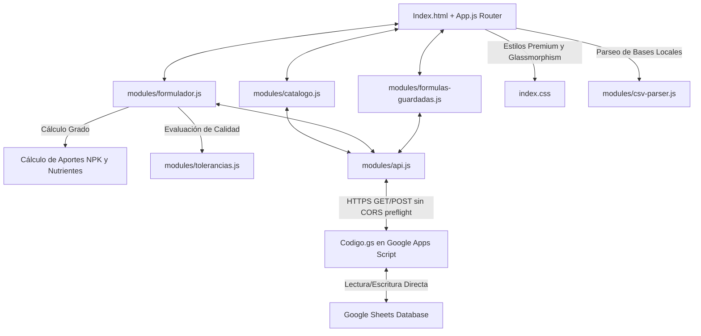

# Rundown Técnico y Funcional: Formulador CFQ
Este documento presenta un análisis profundo, estructurado y detallado (rundown) del módulo **Formulador CFQ** ubicado en [SGC_CALFERQUIM/formulador/](file:///home/w182/w421/cfq_sgc/SGC_CALFERQUIM/formulador). 

---

## 1. Propósito y Arquitectura General
El **Formulador CFQ** es una aplicación web interactiva de tipo Single-Page Application (SPA) diseñada a la medida para **CALFERQUIM S.A.S.**. Su objetivo principal es automatizar el cálculo del grado final de mezclas de fertilizantes, contrastar los resultados contra las tolerancias regulatorias oficiales del **ICA (Instituto Colombiano Agropecuario)** y registrar fórmulas en tiempo real en una base de datos centralizada de Google Sheets.

### Diagrama de Bloques e Interacciones

---

## 2. Inventario y Rol de Módulos (Backend & Frontend)

### A. Backend / Persistencia (`Codigo.gs`)
Es el script de servidor que corre sobre **Google Apps Script (GAS)**, apuntando a la hoja de cálculo de Google Sheets con ID `1byEDPlKWmgLYGpnuwbygVwBGanSflybKBA9VVdITgPE`.
*   **Modelo de Datos**: Soporta dos tablas fundamentales estructuradas con cabeceras fijas:
    *   `catalogo_mp`: Registro de materias primas con 28 campos (ID, código, nombre, proveedor y concentraciones individuales de nutrientes, incluyendo subfracciones de Nitrógeno como Amoniacal, Nítrico, Orgánico y Ureico).
    *   `formulas`: Historial de formulaciones guardadas con 48 columnas, mapeando dinámicamente hasta 11 slots de materias primas por mezcla (Código, Nombre, Cantidad en proporción y Lote), resultados calculados finales de nutrientes (`T_N`, `T_P`, `T_K`, etc.), estados (Borrador/Guardada), fechas y metadatos.
*   **API REST**: Expone endpoints de lectura (`doGet` con acciones como `ping`, `getMP`, `getFormulas`, `getFormula`) y escritura (`doPost` con acciones como `saveMP`, `saveFormula`, `updateFormula`, `deleteFormula`, `cloneFormula`).

### B. Enrutador y Scaffolding Principal (`index.html` & `app.js`)
*   **`index.html`**: Estructura semántica HTML5 pura (responsiva e inclusiva con accesibilidad mediante `skip-link` y roles ARIA). Contiene el contenedor principal de la vista `#app-view`, la barra de navegación con pestañas de interacción y el indicador visual de conexión.
*   **`app.js`**: Enrutador dinámico (SPA) que carga y desmonta las vistas bajo demanda (`Catalogo`, `Formulador`, `FormulasGuardadas`). Maneja las transiciones de CSS, inicializa configuraciones de almacenamiento local (`localStorage`) e implementa un verificador en segundo plano (cada 60 segundos) del estado de conexión de la API REST para alternar de forma transparente entre modo **Online** y **Offline** (usando caché local).

### C. Motor del Formulador (`modules/formulador.js`)
El núcleo funcional de la interfaz del formulador.
*   **Gestión de Slots**: Ofrece una rejilla dinámica de hasta **11 slots de insumos** independientes donde se definen las materias primas (mediante campos inteligentes de autocompletado y búsqueda instantánea), sus proporciones de mezcla (de 0 a 1) y los números de lote respectivos.
*   **Escalamiento de Peso**: Acepta un volumen total de producción (en kilogramos). Al modificar este valor, escala de inmediato las proporciones para mostrar en tiempo real los kilogramos netos requeridos de cada insumo.
*   **Procesamiento Matemático**: 
    $$\text{Aporte del Nutriente } K = \sum_{i=1}^{11} (\text{Proporción Insumo } i \times \text{Concentración del Nutriente en Insumo } i)$$
    Posteriormente, divide de forma exacta las concentraciones por tonelada y las redondea a 2 cifras decimales para la visualización del grado teórico final.

### D. Motor Regulatorio de Tolerancias (`modules/tolerancias.js`)
Implementa matemáticamente con rigurosidad las directrices del ICA colombianas:
*   **Grupo 1 (Nitrógeno Total y Fósforo)**: Aplica una curva polinómica para valores intermedios:
    $$\text{Tolerancia} = -0.0005 \times X^2 + 0.0413 \times X + 0.6533$$
    *Con topes mínimos de 0.84% (si $X < 0.04\%$) y máximos de 1.46% (si $X > 32\%$).*
*   **Grupo 2 (Potasio)**: Curva restrictiva específica:
    $$\text{Tolerancia} = -0.0007 \times X^2 + 0.0769 \times X + 0.3941$$
    *Con topes mínimos de 0.69% y máximos de 2.14%.*
*   **Grupo 3 (Elementos Secundarios y Micronutrientes)**: Selecciona siempre el **menor valor** obtenido entre:
    1.  La mitad del valor declarado ($X / 2$).
    2.  Un límite fijo absoluto del $1.5\%$.
    3.  La ecuación lineal específica asignada por el ICA al elemento (ej. Azufre: $0.3 + 0.075 \times X$; Zinc/Cobre: $0.015 + 0.3 \times X$).

### E. Integración de API y Transmisión Inteligente (`modules/api.js`)
Maneja la lógica de comunicación con Google Apps Script. 
> [!IMPORTANT]
> **Evitación de Bloqueos CORS y Robustez en el Envío:**
> 1. Para peticiones normales de envío de datos, se utiliza `fetch` enviando el cuerpo en formato `text/plain`, lo que clasifica la petición HTTP como un **Simple Request** y evita que el navegador realice una solicitud preflight `OPTIONS` (la cual es usualmente rechazada o mal manejada por Google Apps Script).
> 2. Si el navegador no soporta o bloquea la llamada fetch, cuenta con un mecanismo de respaldo automático (`_postViaForm`) que inyecta de forma asíncrona un `form` HTML invisible apuntando a un `iframe` oculto para transmitir el payload como un envío clásico cross-origin sin interrupciones visuales para el usuario.

### F. Herramientas Auxiliares (`modules/utils.js`)
Contiene utilidades de uso generalizado:
*   Normalización automática de decimales (convirtiendo entradas de coma `,` a punto `.` para evitar fallos matemáticos).
*   Formateo adaptado al estándar colombiano (`es-CO`) para visualizaciones numéricas de grados y toneladas.
*   Cifrado criptográfico nativo en navegador (`crypto.getRandomValues`) para generar IDs únicos de 8 caracteres hexadecimales en el registro de fórmulas.
*   Gestión de diálogos interactivos personalizados de confirmación modal y avisos contextuales flotantes (*Toasts*).

---

## 3. Lógica de Calidad Regulatoria (Evaluación en Tiempo Real)
Cuando el usuario define un producto de destino (por ejemplo, un fertilizante NPK registrado) e introduce los componentes de su fórmula, el sistema evalúa dinámicamente cada elemento comparando el resultado **calculado** con el valor **declarado (u objetivo)**:

*   **✓ C (Conforme)**: El grado calculado está dentro del rango permitido $[ValorDeclarado - Tolerancia, ValorDeclarado + Tolerancia]$.
*   **⚠ SUP (Supera Tolerancia)**: El grado calculado supera el límite superior del rango. En control regulatorio, esto indica que se ha sobredosificado un nutriente (lo cual es aceptable técnicamente pero incrementa los costos de producción).
*   **✕ NC (No Conforme)**: El grado calculado está por debajo del rango permitido. Esto representa un **riesgo regulatorio alto**, puesto que el ICA sancionará el lote si los análisis de laboratorio reportan deficiencias por debajo de la tolerancia permitida.

El sistema entrega además un **Estado General**: si un solo nutriente resulta **NC (No Conforme)**, toda la mezcla se bloquea y califica automáticamente como **NO CONFORME**, forzando al operador a ajustar la fórmula antes de enviarla a producción.

---

## 4. Visual y Diseño
La interfaz cuenta con un diseño premium y moderno, implementado en vanilla CSS (`index.css`):
*   **Tokens de Diseño Moderno**: Define una paleta de color sofisticada basada en HSL, destacando verdes esmeralda (`#059669`) y turquesas para denotar conformidad y frescura agroquímica, grises profundos para el modo oscuro/neutral y degradados premium de fondo.
*   **Micro-animaciones**: Transiciones fluidas en la entrada de las vistas (`view--entering`), efectos de hover sutiles en los slots y una barra de progreso que cambia dinámicamente de color (cambiando a rojo o naranja al sobrepasar el límite máximo de $1,000\text{ kg}$ de mezcla en proporciones).
*   **Tipografía de Precisión**: Usa las fuentes premium *Inter* para elementos de lectura rápida e interfaz general, y *JetBrains Mono* para alineaciones y visualizaciones de datos numéricos y concentraciones químicas.
